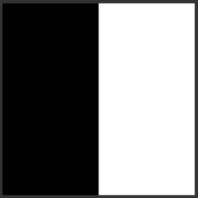

# FragShaderTemplate

A template for fragment shader development with ThreeJS

# Live Demo

[View the Live Demo](https://strawstack.github.io/FragShaderTemplate/.)

# Screenshot

# Todo

- [x] Alter code to show one plane in a 500x500 pixel canvas
